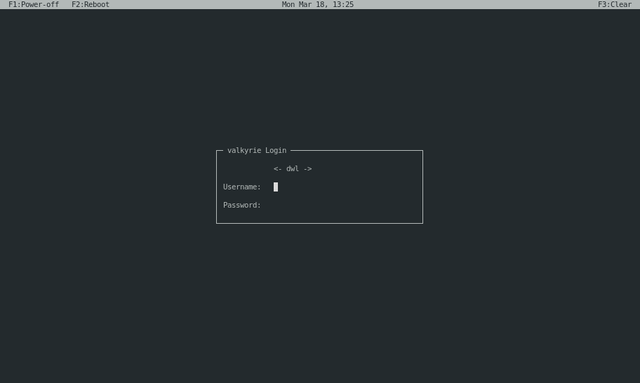

# NCGreet

NCurses greeter for [greetd].

## Description

 - Written in C++ and ncurses library
 - Organized in a way it makes sense
 - Sessions are read from proper place (/usr/share/wayland-sessions)
   - TODO: include Xorg sessions (I don't use X)

[greetd]: https://git.sr.ht/~kennylevinsen/greetd

### Screenshots

### Building

    > meson setup build
    > ninja -C build || exit 1
    > sudo ninja -C build install

 - Build dependencies:
   - ncurses
   - jsoncpp
 - Run dependency: greetd

### Configuration and usage

**Setting up greetd**

Edit /etc/greetd/config.toml

    [terminal]
    vt = 1

    [default_session]
    command = "ncgreet"
    user = "greeter"

**Configuration of ncgreet**

Still not yet implemented

## Version log

 - 0.1 (Work in progress)
   - Goal: Get the base code in working order.

